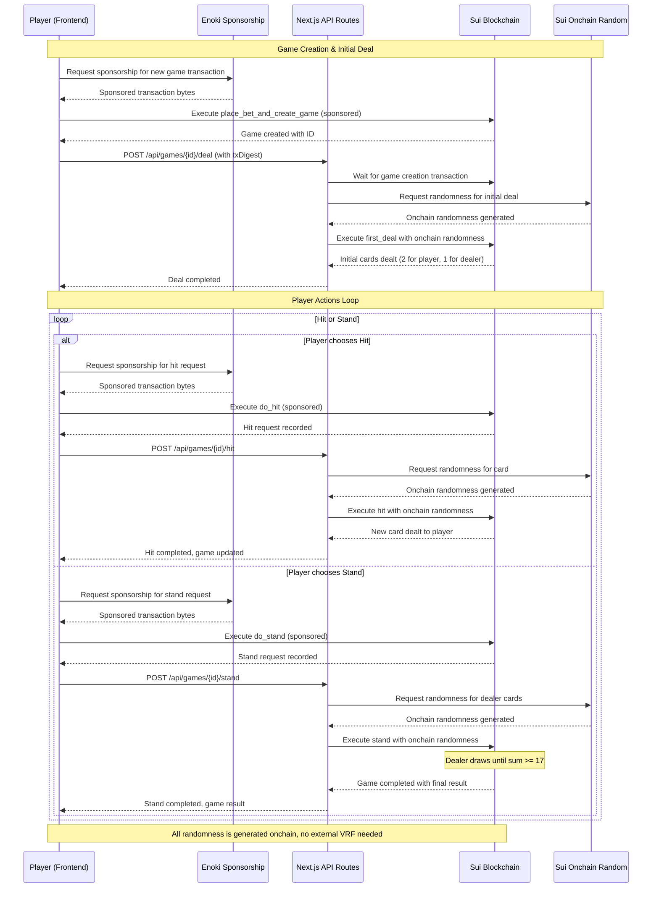

# BlackJack with Sui and Move

This repo contains code for the BlackJack on Sui Blockchain game, built with Move smart contracts and a Next.js frontend with integrated API routes for Enoki sponsorship functionality.

## Sui Blackjack Modules

### `single_player_blackjack.move`

Defines the game object and provides methods to create and play a game. The overall flow of invocation is:

- **Admin** (owner of the HouseCap object) invokes the `initialize_house_data` function that can be called only once (Capability is destroyed).
- **Player** invokes the `place_bet_and_create_game` Move function that receives the bet and creates a new game (sponsored by Enoki).
- **Dealer** invokes the `first_deal` Move function that performs the initial deal using Sui's onchain randomness.
- **Player** invokes the `do_hit` Move function that records the player's intent to hit, by minting and transferring a `HitRequest` object to the admin (for the specific game, player, and game's state)
- **Dealer** invokes the `hit` Move function that performs the hit action using onchain randomness (providing as input the corresponding HitRequest object)
- **Player** invokes the `do_stand` Move function that records the player's intent to stand, by minting and transferring a `StandRequest` object to the admin (for the specific game, player, and game's state)
- **Dealer** invokes the `stand` Move function that performs the stand action using onchain randomness (providing as input the corresponding StandRequest object)

## Quickstart

1. cd into the setup/ directory: `cd setup/`
2. install the npm dependencies with: `npm i`
3. initialize your `environmental variables` based on the `Environment variables` section of the `setup/README.md` file
4. Run the following:
  1. Publish the contracts with: `./publish.sh testnet`
  2. Initialize the house data with: `npm run init-house` (admin account needs to have at least 10 SUI + gas, to top-up the initial house funds)
5. cd back into the app/ directory: `cd ../app/`
6. install the pnpm dependencies with `pnpm i`
7. generate TypeScript bindings for the Move contracts with: `pnpm codegen` (uses [@mysten/codegen](https://www.npmjs.com/package/@mysten/codegen))
8. start the development server with `pnpm run dev`

**Note:** The TypeScript bindings are auto-generated from the Move contracts using [@mysten/codegen](https://www.npmjs.com/package/@mysten/codegen), which creates type-safe client code for interacting with the smart contracts.

## Gameplay

- This is a 1-1 version of the game, where the player plays against the dealer (machine).
- Player places bet and starts game using Enoki sponsorship for gas-free transactions.
- Game uses Sui's built-in onchain randomness for card generation, eliminating the need for external VRF.
- Next.js API routes handle dealer actions and Enoki sponsorship integration.
- Player can _Hit_ or _Stand_
  - If _Stand_ is selected, then the Dealer draws cards until reaching a sum >= 17.
    - If Dealer reaches a number >= 17, he Stops. Then the Smart Contract compares sums and declares the winner.
  - If _Hit_ is selected, then Dealer draws a card for the player.
- Every action (Deal, Hit, Stand) is comprised from 2 distinct transactions. The first one is initiated from the player
  to capture the intent of the user to perform an action. The second one is initiated from the Next.js API routes,
  as a response action to the first one and performs the actual business logic using onchain randomness.

More details are depicted on the [Game Flow](#game-flow) section below.

**_Stake is fixed at 0.2 SUI_**

## Game Flow

The overall game flow is presented in the following sequence diagram:

### Source Code Directories structure

- **move:**
  - Contains the Move code of the smart contracts
  - Contains a move package named `blackjack` which contains the Move code of the smart contracts
  - Uses Sui's built-in onchain randomness for card generation

- **app:**
  - Contains the full-stack Next.js application
    - **Frontend:** React.js with Next.js Framework and Tailwind CSS
    - **Backend API Routes:** Next.js API routes for dealer actions and Enoki sponsorship
      - `/api/sponsor` - Handles Enoki transaction sponsorship
      - `/api/execute` - Executes sponsored transactions
      - `/api/games/[id]/deal` - Handles initial deal logic
      - `/api/games/[id]/hit` - Handles hit actions
      - `/api/games/[id]/stand` - Handles stand actions
    - **Services:** Transaction handling and Sui blockchain integration
    - **Helpers:** Utility functions for game logic and blockchain interaction

- **setup:**
  - A Typescript project, with a ready-to-use:
    - environment variable (.env) file reading
    - Sui SDK integration
    - [publish shell script](./setup/publish.sh)
