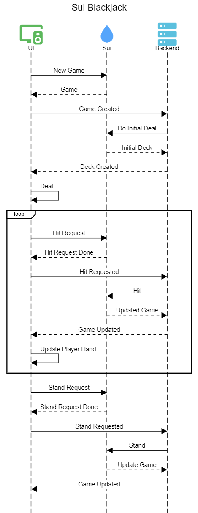

# BlackJack with Sui and Move

This repo contains code for the BlackJack on Sui Blockchain game, built with Move.

## Sui Blackjack Modules

### `single_player_blackjack.move`
Defines the game object and provides methods to create and play a game.

### `counter_nft.move`
This module defines the Counter NFT object and provides methods to create and increment it. 
The Counter NFT is used as the VRF input for every game that a player plays. 
The count always increases after use, ensuring a unique input for every game. 
A player is required to create a Counter NFT before playing their first game. 
The UI can seemlessly create the Counter NFT for the user by including the counter creation along with the game creation function in the same PTB.

## Gameplay

- This is a 1-1 version of the game, where the player plays against the dealer (machine).
- Dealer has a public BLS key.
- Player creates randomness by moving their mouse over screen, places bet and starts game.
- Dealer backend listens to the start transaction, signs and distributes 2 cards for player and 1 for dealer.
- Player can _Hit_ or _Stand_
  - If _Stand_ is selected, then the Dealer draws cards until reaching a sum >= 17.
    - If Dealer reaches a number >= 17, he Stops. Then the Smart Contract compares sums and declares the winner. 
  - If _Hit_ is selected, then Dealer draws a card for the player.
- For Frontend-Backend communication, a custom websocket server is used.
- Every action (Deal, Hit, Stand) is comprised from 2 distinct transactions. The first one is initiated from the player 
in order to capture the intent of the user to perform an action. The second one is initiated from the dealer backend, 
as a response action to the first one and performs the actual business logic.

More details are depicted on the [Game Flow](#game-flow) section below.

**_Stake is fixed at 0.2 SUI_**

## Game Flow
The overall game flow is presented in the following sequence diagram:

### Source Code Directories structure

- move:

  - Contains the Move code of the smart contracts
  - Contains a move package named `blackjack` which contains the Move code of the smart contracts.

- app

  - Contains The frontend code of the app. 
    - React Framework
    - Next.js
    - Tailwind CSS

- setup
  - A Typescript project, with a ready-to-use:
    - environment variable (.env) file reading
    - Sui SDK integration
    - publish shell script
